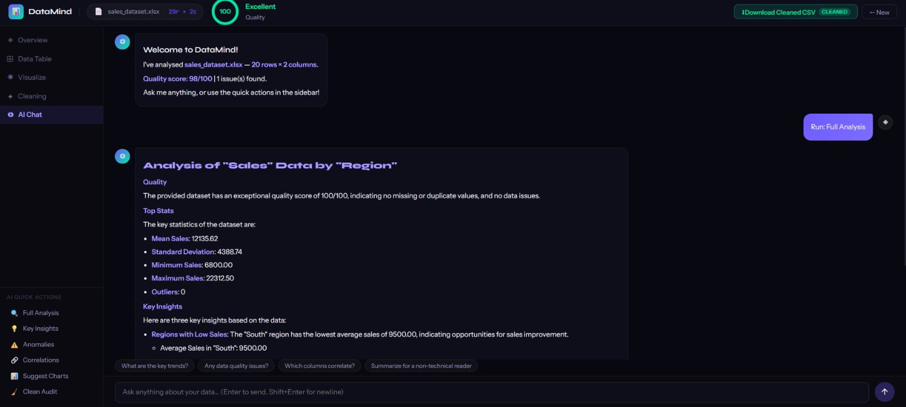
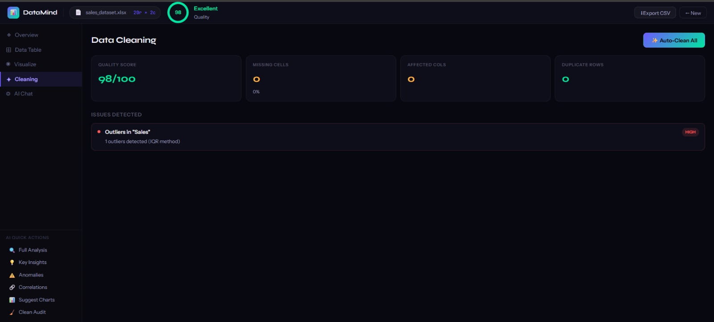
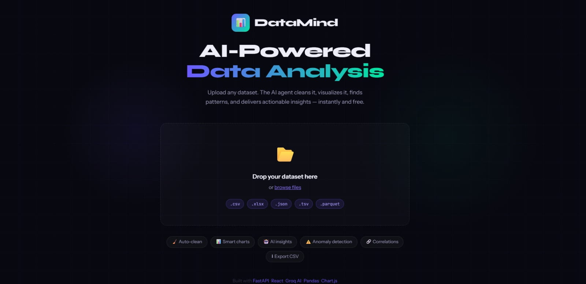
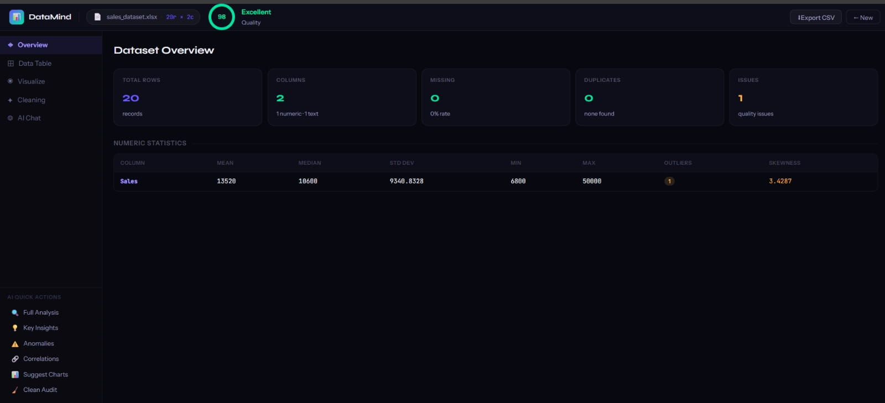
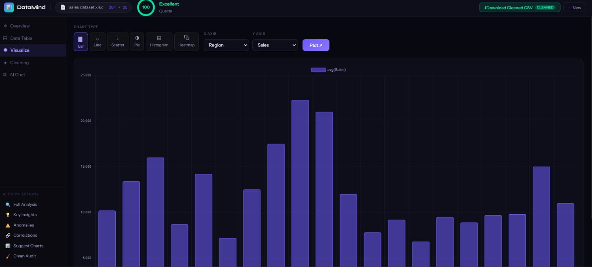

# DataMind — AI Data Analyst (powered by Groq)

Full-stack AI data analysis platform. Upload any dataset → auto-clean → visualize → chat with AI.

## Tech Stack

- **Backend:** FastAPI + Pandas + NumPy + Groq AI (free)
- **Frontend:** React 18 + Vite + Chart.js + Framer Motion

## 📸 Screenshots

### AI Chat



### Data Cleaning



### File Upload



### Overview Dashboard



### Data Visualization



## Setup (Windows PowerShell)

### 1. Backend

```powershell
cd dataanalyst\backend
python -m venv venv
venv\Scripts\activate
pip install -r requirements.txt
uvicorn main:app --reload --port 8000
```

### 2. Frontend (new PowerShell window)

```powershell
cd dataanalyst\frontend
npm install
npm run dev
```

### 3. Open browser

```
http://localhost:5173
```

### 4. Test AI is working

```
http://localhost:8000/api/test-ai
```

## Get Free Groq API Key

1. Go to https://console.groq.com
2. Sign up (free, no credit card)
3. API Keys → Create Key
4. Copy and use in step 1 above

## Features

- Upload CSV, Excel, JSON, TSV, Parquet
- Auto-detect column types and data quality
- One-click data cleaning (nulls, duplicates, outliers)
- 6 chart types with interactive controls
- Correlation heatmap
- AI chat powered by Llama 3.1 (free via Groq)
- 6 quick AI analysis actions
- Export cleaned CSV

## API Endpoints

| Method | Endpoint            | Description                  |
| ------ | ------------------- | ---------------------------- |
| GET    | /health             | Health check                 |
| GET    | /api/test-ai        | Verify AI is working         |
| POST   | /api/upload         | Upload dataset               |
| GET    | /api/data/{id}      | Paginated table              |
| GET    | /api/chart/{id}     | Chart data                   |
| POST   | /api/clean          | Clean dataset                |
| GET    | /api/export/{id}    | Download CSV                 |
| POST   | /api/chat           | AI chat (streaming)          |
| POST   | /api/quick-analysis | Quick AI actions (streaming) |
